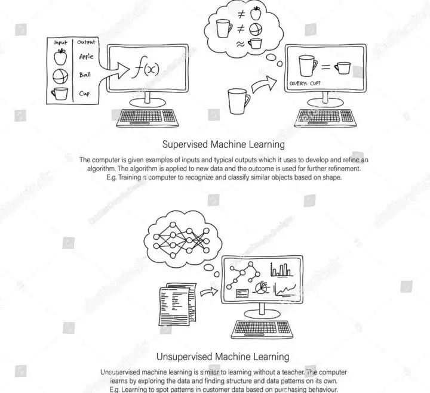

# Makine Öğrenmesi Nedir ? 

Makine öğrenmesi bir bilgisayar programının doğrudan yönergeler olmadan öğrenme ve geliştirme yeteneğine sahip olmasıdır. Bu yetenek, matematiksel modeller ve öğrenme algoritmaları kullanarak bir makineyi öğretmek ve öğrendikleriyle ilgili tahminler yapmasına olanak tanır.

Makina öğrenmesi veri biliminin bir alt dalıdır ve veriye dayalı karar verme süreçlerini otomatikleştirir.

Makina öğrenmesi, verilerdeki kalıpları belirlemek için algoritmaları kullanır. Bu kalıpları kullanarak gelecekti verilere yöneklik tahminler yapabilir. Tıpkı insanlarda ki gibi veri ve deneyim miktarı arttıkça makine öğnremesinin sonuçları da daha doğru hale gelir.

## Makine Öğrenimi Kullanım Alanları

1. ***E-posta spam filtreleme:*** Bir makine öğrenimi modeli, verilen e-posta mesajlarından öğrendiklerini kullanarak spam e-postaları tespit etmeye çalışabilir.
2. ***Otomatik ses tanıma:*** Bir makine öğrenimi modeli, verilen ses dosyalarından öğrendiklerini kullanarak, ses dosyalarında ne olduğunu anlamaya çalışabilir. Örneğin, bir makine öğrenimi modeli, bir telefon görüşmesinde konuşulan kelimeleri tespit etmeye çalışabilir.
3. ***Otomatik makale özetleme:*** Bir makine öğrenimi modeli, verilen bir makaleden öğrendiklerini kullanarak, makaledeki ana fikirleri özetleyebilir.
4. ***Otomatik çeviri:*** Bir makine öğrenimi modeli, verilen bir metin dosyasının bir dilinden öğrendiklerini kullanarak, metni başka bir dile çevirebilir.

## Makine öğrenimi türleri nelerdir ?

- ***Denetimli (Supervised) Makine Öğrenmesi:*** Denetimli makine öğrenimi algoritmaları en yaygın olarak kullanılanlardır. Bu model sayesinde, veri uzmanı bir kılavuz olarak hareket eder ve algoritmaya hangi sonuçlara varması gerektiğini öğretir.

- ***Denetlenmeyen (Unsupervised) Makine Öğrenmesi:*** Denetlenmeyen makine öğrenimi, bir insan tarafından sürekli ve yakın kılavuzluk sağlanmadan bilgisayarın karmaşık süreçleri ve modelleri öğrendiği daha bağımsız bir yaklaşımdan yararlanır. Bu teknikte veri kümeleri etiket veya yapı olmadan işlenir, veriler kümeler halinde gruplandırılarak kalıplar ve ilişkiler bulunur.

## Makine Öğrenimi Potansiyeli

Makine öğrenimi kurumların günümüzde mevcut olan veri zenginliğinden iş değeri elde etmelerine yardımcı olma konusunda muazzam bir potansiyel sunuyor. Çoğu şirket ellerinin altında ki bu potansiyeli daha iyi ürünler üretmek ve pazarda daha büyük pay sahibi olmak için kullanmaya çalışıyor. Makine öğrenmesinin iş değerine olan olumlu etkisi yüzünden ilerleyen yıllarda dahi popülerliğinden ve öneminden bir şey kaybetmiyeceğini gösteriyor aynı zamanda gelişmeye çok açık olan bu alanda kalifiye iş gücü olan ihtiyaç günden güne artıyor. Kendisini bu alana yönelten ve iyi bir şekilde eğiten kişiler bulunmaz nimet konumundalar. 

> Farkında olmayabilirsiniz ama yapay zeka her yerdedir. - Judy Woodruff

